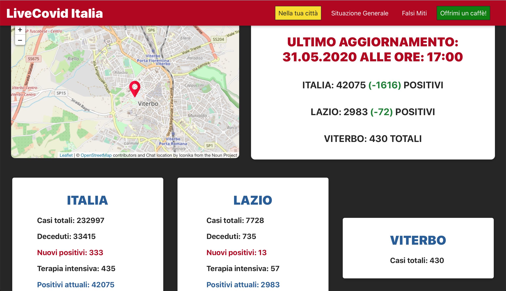
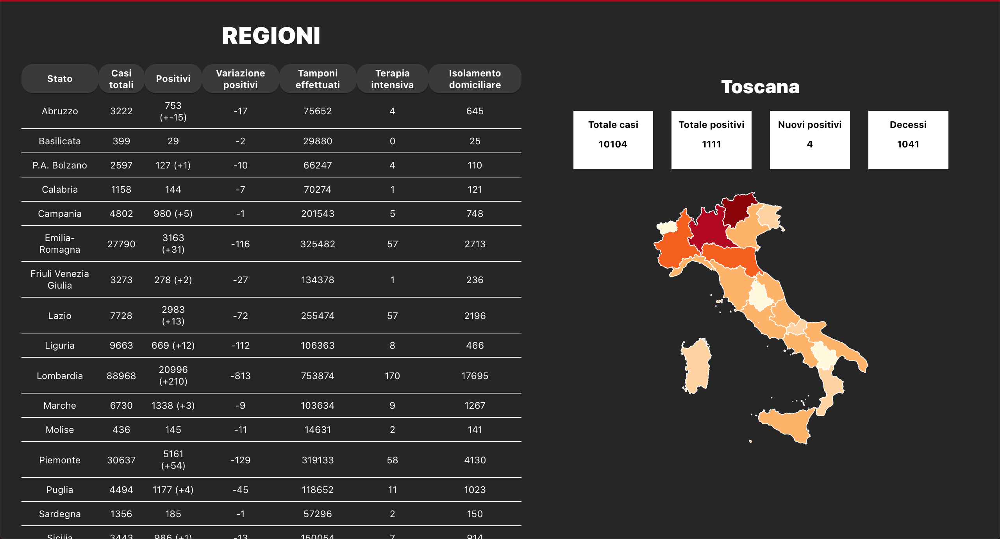

# Live Covid Italia 
## A live covid-19 cases traker for Italy.

### Website online at https://www.live-covid.it o www.live-covid.it

## Page

- The home page takes your location (it ask you if you want to share the live location) and give you all the informatin about covid-19 in your region and city:
    - If you agree the location is exact and it gives you the info about your city
    - If you don't agree the location is estimated with your IP address and it's not exact (Notice: google chrome block all if you don't agree!)
- The 'Situazione Generale' page gives you all the infomation about the Covd-19 in the whole state with the possibility to tap on a region in the image of Italy and see the info about that region one.
- In the 'Falsi Miti' there are some mythes about the Covid19  grabbed in the page of WHO (World healt organization)

***Today this website works only in Italy, but in the future will works in different States***

## How to contribute?
- If you want to contribute you can by following these step.
- Fork this repository by clicking the fork button on the top right of this page.
- Clone that forked repository in your local, make changes, test and then push to your forked branch.
- Create a pull request from your forked repo to this repo.

## Disclaimer
This is not an official government project. This is not associated in any way with my employer. I am not getting paid to do this. This is created to keep people informed about the current state of Covid-19 in the country.

If you feel any information is missing or there is any error, please feel free to create [ an issue](https://github.com/Quoll905/liveCovid/issues/new) or reach out to me directly on [Facebook](https://www.facebook.com/marco.marazzi.359) or [Instagram](https://www.instagram.com/marco.marazzi/) and I would be happy to assist.